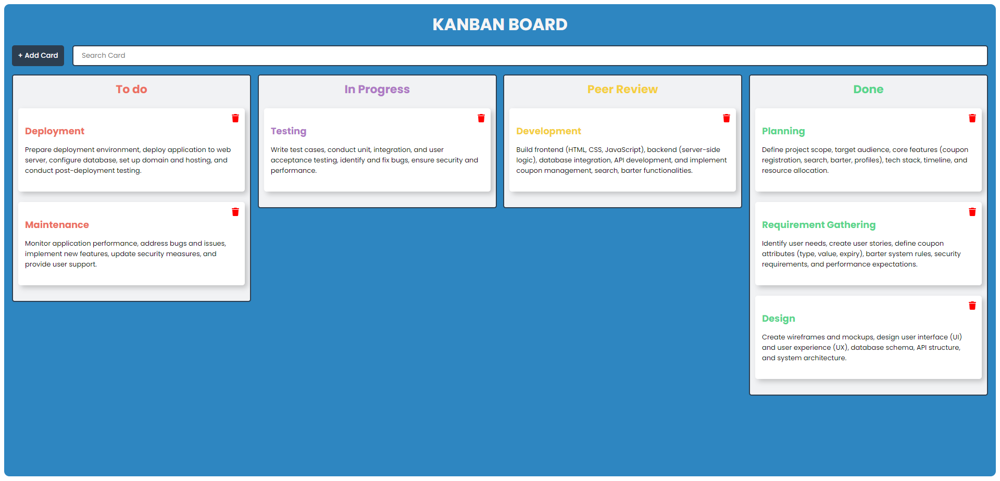

# Kanban Board

Web based Kanban board web app is a digital tool that visually represents a workflow. It's based on the Kanban method, which originated in manufacturing but has been adapted for project management and task organization.

## Kanban Board preview

Key features of a Kanban board include:

- Visual representation: Tasks are displayed as cards on virtual boards.
- Columns: Cards are organized into columns representing different stages of a workflow (e.g., To Do, In Progress, Peer Review, Done).
- Drag-and-drop: Users can easily move cards between columns as tasks progress.
- Delete: User can delete any card that is not required.
- Search: User can dynamically search for the card by typing the card title name.
- Reponsive: The Board can be viewed and edited on any screen size with consistent user experience.

## Tools used for this project:

- `Reactjs`
- `HTML5`
- `CSS3`
- `ES14`

## Internal Libraries used:

- `read-beautiful-dnd` for drag and drop functionality.
- `react-fontawesome` to add dynamic icons.
- `uuid` for generating unique id's.

## Set up the Kanban Board:

### Requirements:

- Make sure node, npm is installed on you system. Can be installed using command line or from the official Nodejs website.

### Installation:

- Download the zip file of the project and extract it on a desired location or clone it on your local system using git.
- After downloading navigate to the project directory on you local system.
- Run the following command to install all the dependencies: `npm install`, this will install all the dependencies incliding React.
- After running the above command the app is all set to run.
- now use the command `npm run dev` to start the application on you local server.
- The Web app is now running on the port number `5173` and can be accessed on the followind address: `localhost:5173`.
